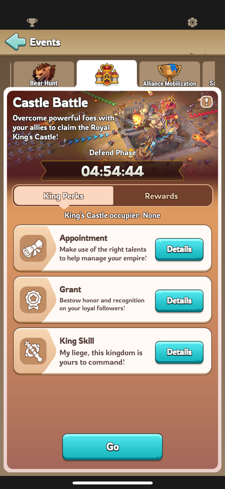
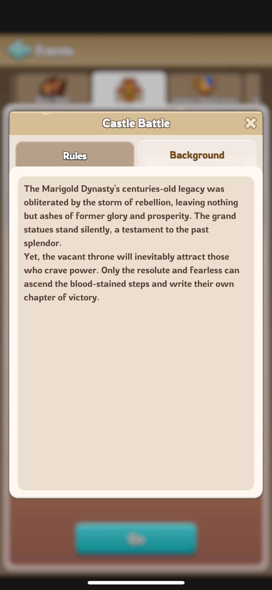
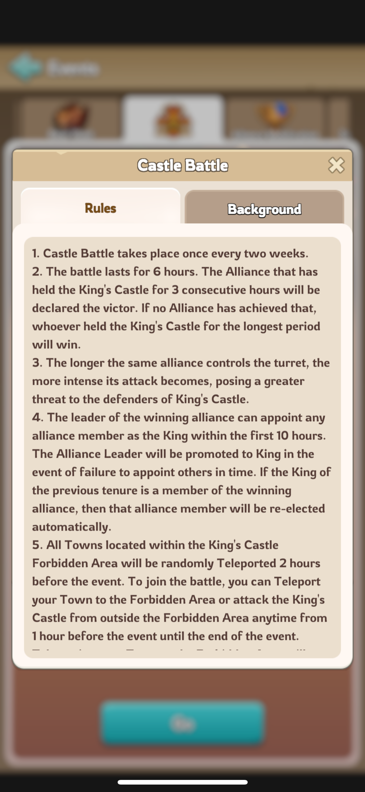
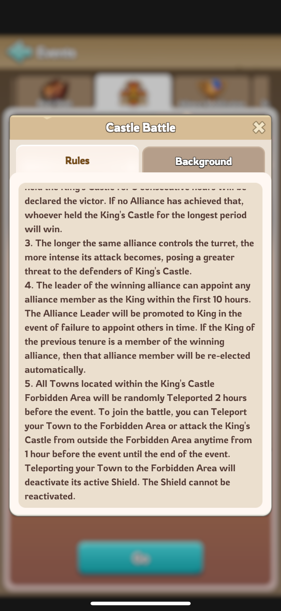
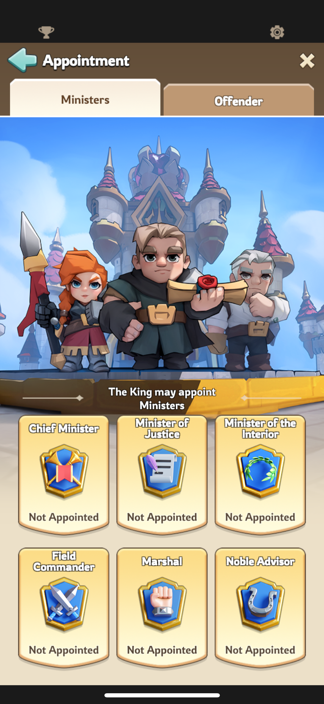
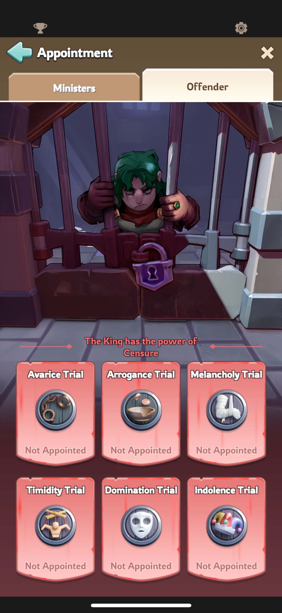
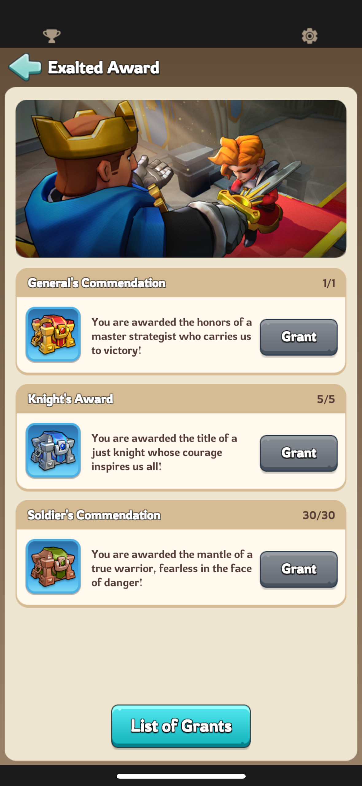
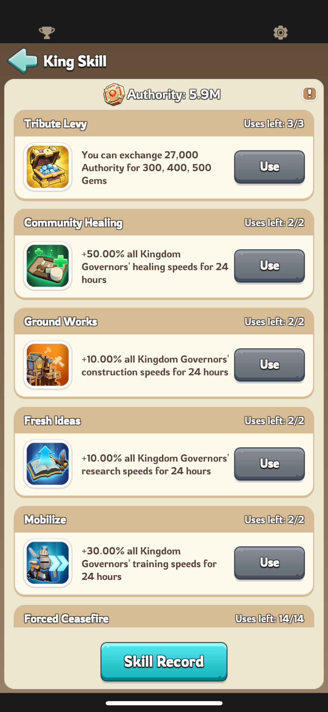
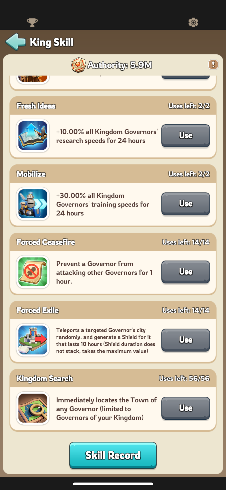
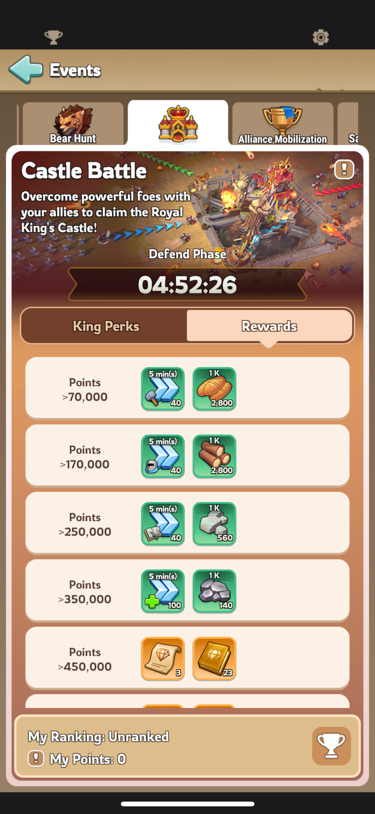

# Castle Battle

## Description

## Rules

## King Perks

### Appointment

#### Ministers

| Minister             | Bonus                                                                                       |
| -------------------- | ------------------------------------------------------------------------------------------- |
| Chief Minister       | Construction Speed +10% Research Speed +10% Training Speed +10%                       |
| Minister of Justice  | Resource Production Speed +80% The power to appoint and remove officials in King's place |
| Minister of Interior | Healing Speed +100% Infirmary Capacity +5000                                             |
| Field Commander      | Appointment-based Squads' Lethality +10%                                                    |
| Marshal              | Appointment-based Squads' Attack +5% Squads' Deployment Capacity +2500                   |
| Noble Advisor        | Training Speed +50% Training Capacity +200                                               |

#### Offenders

| Offender         | Malus                                                                     |
| ---------------- | ------------------------------------------------------------------------- |
| Avarice Trial    | Construction Speed -10% Research Speed -10% Training Speed -10%     |
| Arrogance Trial  | Resource Production Speed -40%                                            |
| Melancholy Trial | Healing Speed -50% Infirmary Capacity -2500                            |
| Timidity Trial   | Appointment-based Squads' Lethality -5%                                   |
| Domination Trial | Appointment-based Squads' Attack -2% Squads' Deployment Capacity -1500 |
| Indolence Trial  | Training Speed -25% Training Capacity +100                             |

### Grant Exalted Awards

### King Skills

## King Rewards

