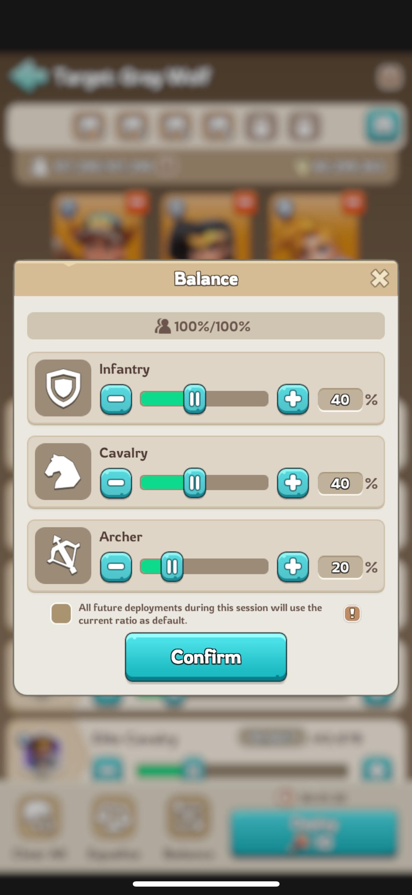

# Formations

When you send out troops, you can choose how many infantries/cavalries/archers you will send.

Usually you'll send 1/3 each, but this is not optimal.

When defining a formation, usually you'll get a request like 50/30/20, meaning 50% infantry, 30% cavalry, 20% archers.

You can set these numbers when selecting troops, using the "Balance" button.

Example of a 40/40/20 formation:

{width=350px}

## Common known formations

### Bear
10/10/80

### Mystic Trial

| Event           | Formation |
| --------------- | --------- |
| Coloseum        | 50/10/40  |
| Forest of Life  | 50/15/35  |
| Crystal Cave    | 60/20/20  |
| Knowledge Nexus | 50/20/30  |
| Molten Fort     | 60/15/25  |
| Radiant Spire   | 50/15/35  |

