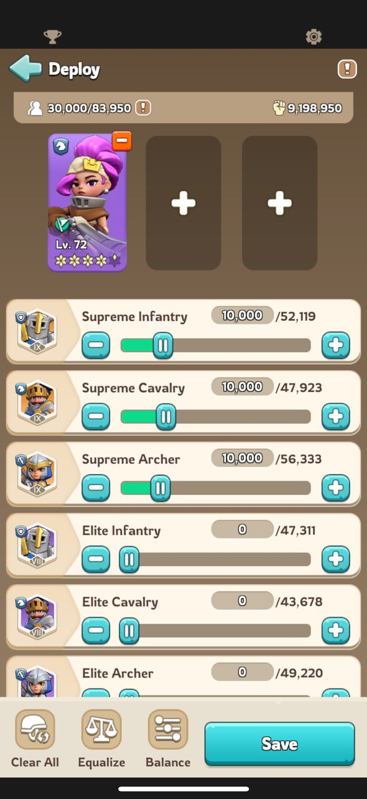

# Rallies

## Starting a rally

What the game uses:

- your stats boosts
- the troops you dispatch
- of each of the 3 heroes:
  - all their skills
  - all their equipments

For this reason, it is suggested to use the 3 strongest heroes you have, which usually involves also one of:

**Amadeus**
{width=150px height=150px}

**Jabel**
{width=150px height=150px}

## Joining a rally

In this case, the game will only consider:

- of the left-most hero: the top-right skill
- the troops you dispatch

Everything else is ignored.

For this reason, it is suggested to use only 1 hero, and for that hero to be one of the following:

**Yeonwoo**
{width=150px height=150px}

**Chenko**
{width=150px height=150px}

**Amane**
{width=150px height=150px}

**Amadeus**
{width=150px height=150px}

If none of them is available, it's better to send no hero at all.

An example of a formation to join a rally:

