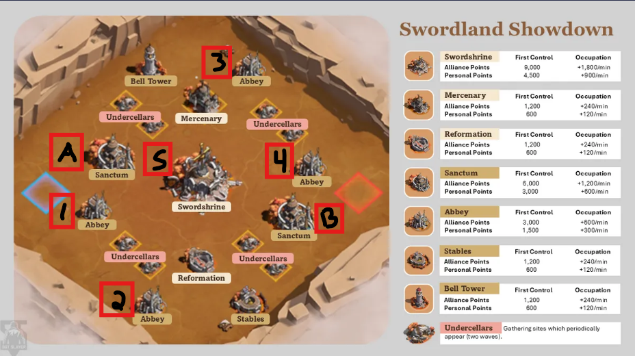

# Swordland

## 1h before event (optional)

Call to go over game mechanics / strategy / chitchat

## 15minutes before event

- Get online
- Recall marches
- Heal troops
- Join discord call
- Team leads verify if presence is enough, reshuffle teams if needed
- Team leads starts dedicated chats

## Event start

- Join event, verify opponents' levels: many TC30? avg TC higher/lower than us? Strategize accordingly
- Team leads set labels on the map

## 2 minutes in

- TP to selected destination
- Selected player start rally to objective
- All players in team reinforce each other

::: tip
Heal your troops
:::

## 12 minutes in

- free teleport is almost completely recharged, Team Leads define new objective

## 15 minutes in

- New structures open, follow Team Lead

::: tip
Heal your troops
:::

...
